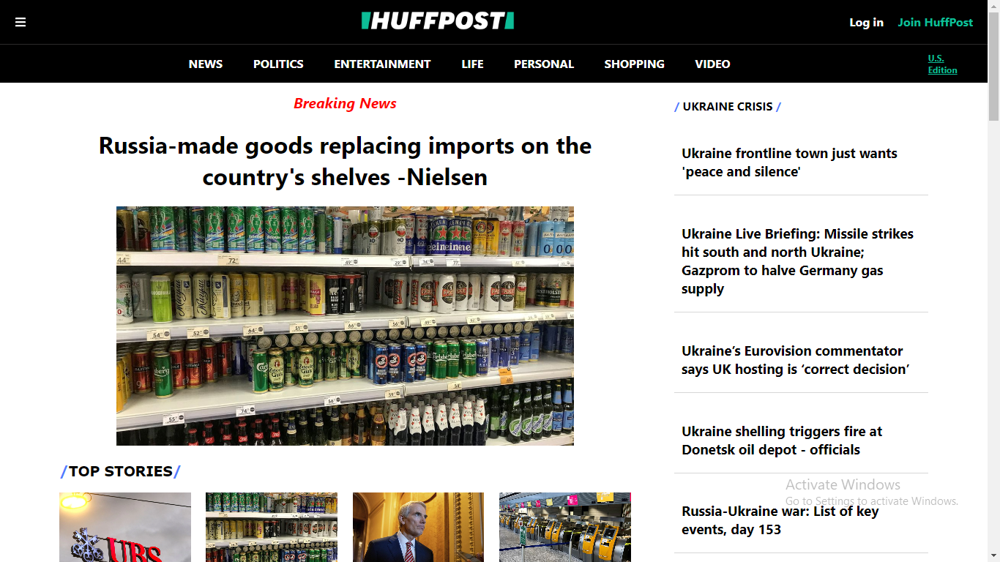
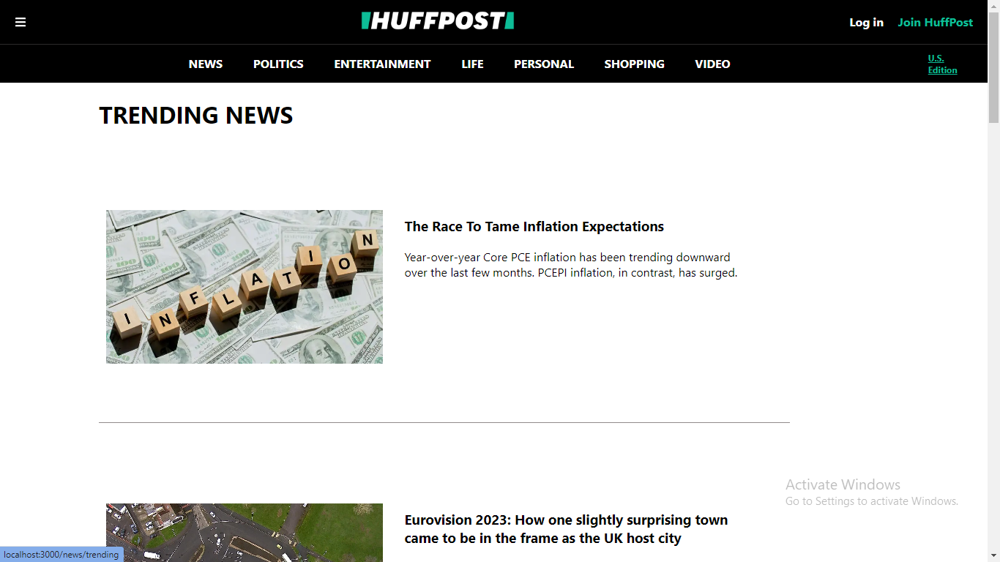
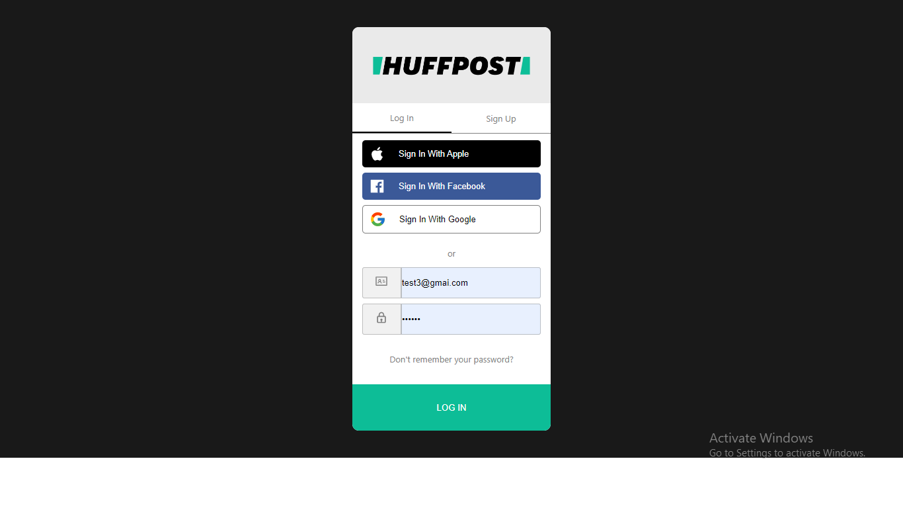
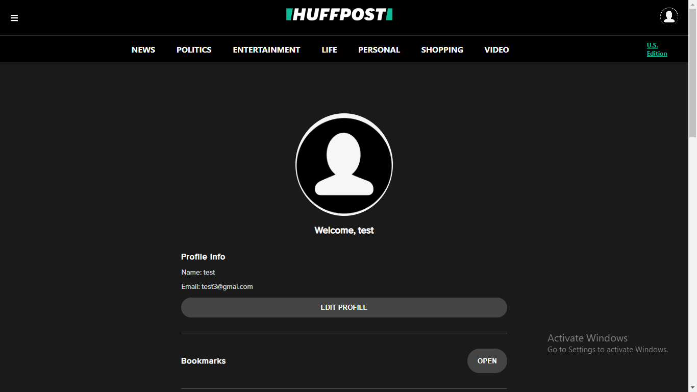

# HuffPost-News-App 🌐

**HuffPost** is an American news aggregator and blog, with localized and international editions. The site offers news, satire, blogs, and original content, and covers politics, business, entertainment, environment, technology, popular media, lifestyle, culture, comedy, healthy living, women's interests, and local news featuring columnists.[1] It was created to provide a liberal alternative to the conservative news websites such as the Drudge Report. The site offers content posted directly on the site as well as user-generated content via video blogging, audio, and photo.[6] In 2012, the website became the first commercially run United States digital media enterprise to win a Pulitzer Prize.

# Technology Stack Used 💻

In this project we have used the following tech stack.

- HTML: [HTML](https://developer.mozilla.org/en-US/docs/Web/HTML)
- CSS: [CSS](https://developer.mozilla.org/en-US/docs/Web/CSS)
- JavaScript:[JavaScript](https://developer.mozilla.org/en-US/docs/Web/JavaScript)
-LocalStorage

 

## Libraries & Frameworks Used 🌟

1. React JS
2.Redux
3.API  [https://currentsapi.services/en]
4.React-icons
5. React-spinners
6.React-Script
7.React-Router
8.Axios

 

## How to run the project 📑

In this project, i were able to achieve a near to perfect clone of the original website. As i do not want to overwhelm you, i haven't shared all the pages here. Please fork the repository and then use it on your own. If you want to collaborate with me on this project then please feel free to reach out to me.

You can also take a glimpse of my Project, just follow the below steps:

    1.Clone the repository in your divice .

    2.In VScode run command npm install to install all dependencies.

    3.Then run npm run start command.

 

## Snapshots 📷

1. Landing Page

   

2. New article Page

   

3. Login Page

   

4. User Profile Page

   

 

## Features ✨

1. User can login or register in web platform.
2. User can read different news

 

## Check out Blog🎥

 

## Team Members and Contributors 😇

👤

👤 **Swapnil Landage**

- Github: [Swapnil1296](https://github.com/Swapnil1296)

